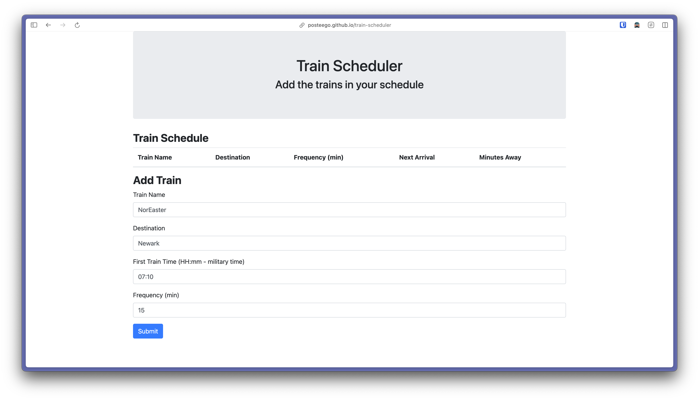

# train-scheduler

**This repo is currently archived. It was part of Columbia's Full-Stack Web Development Bootcamp.**

A simple train schedule table and form that uses firebase for data storage and bootstrap for css. Plain HTML.

